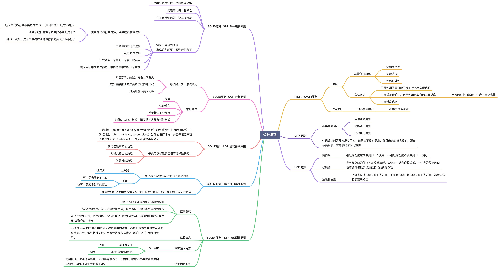

# 设计模式七大原则

## 单一职责原则(Single Responsibility Principle)
简单来说就是，一个类只负责一项职责，降低类的复杂度，提高可读性，降低变更引起的风险。

## 接口隔离原则 (Interface Segregation Principle)
一个类对另一个类的依赖应该建立在最小的接口上。

## 开放-关闭原则 (Open-Closed Principle)
软件实体 (类、模块、函数等等) 应该是可以被扩展的，但是不可被修改。

## 依赖倒转原则 (Dependence Inversion Principle)
1. 高层模块不应该依赖低层模块，二者都应该依赖其抽象。
2. 抽象不应该依赖细节，细节应该依赖抽象

## 里氏替换原则 (Liskov Substitution Principle)
里氏替换原则的重点在不影响原功能，而不是不覆盖原方法。子类可以扩展父类的功能，但不能改变父类原有的功能。

## 迪米特法则（Law Of Demeter）
最少知道原则，它表示一个对象应该对其它对象保持最少的了解。通俗来说就是，只与直接的朋友通信。

## 组合/聚合复用原则 (Composite/Aggregate Reuse Principle)
在一个新的对象里面使用一些已有的对象，使之成为新对象的一部分; 新的对象通过向这些对象的委派达到复用已有功能的目的。

